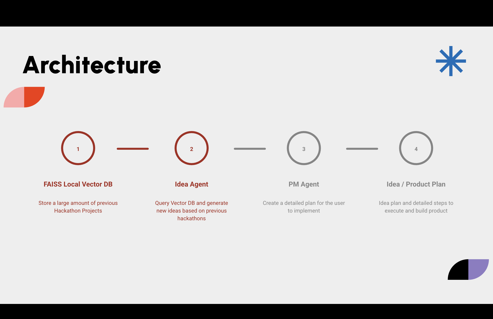

# HackathonPM
HackathonPM acts as your mini PM, scraping inspiration from Devpost, Y Combinator, GitHub, and more to generate fully-scoped project ideas based on your theme. It also builds a detailed execution plan: tech stack, core features, tasks, and pitch summary, all clearly defined for easy implementation by AI or your team.

## Architecture

